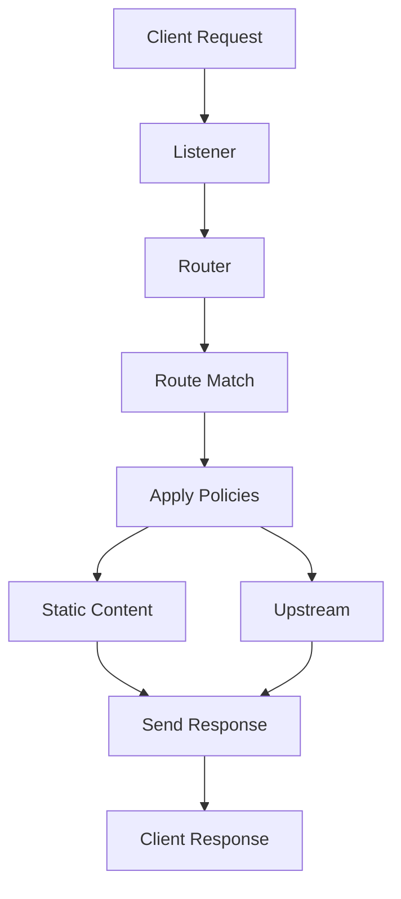

<div align="center">
  
  <br />
  <br />
  <h1>🛡️ Ophan API Gateway</h1>
  <p>
    <b>A lightweight, high-performance api gateway</b>
    <br />
    built on <a href="https://github.com/cloudflare/pingora">Cloudflare Pingora</a>
  </p>
  <p>
    
    
    
  </p>
  <br />
</div>

---

> ⚠️ **DISCLAIMER** — Ophan is under **active development**. APIs, config formats, and behavior may change without notice.  
> It is **not recommended for production use** at this stage. Feedback and contributions are welcome.

---

## 📚 Documentation

The full documentation site is hosted on GitHub Pages:

<https://zsweiter.github.io/ophan/>

---

## 📬 Feedback

Found a bug? Have a suggestion? Reach out:

📧 **zsweiter@gmail.com**

We're early-stage and every piece of feedback helps shape the roadmap.

---

## 🔥 Features

Ophan combines reverse proxy, API gateway, load balancer, and static content delivery into a single modular platform.

| Layer          | Capabilities                                       |
| -------------- | -------------------------------------------------- |
| **Protocols**  | HTTP/1.1, HTTP/2, WebSocket, gRPC                  |
| **Security**   | TLS termination, mTLS, JWT / OAuth2, WAF           |
| **Traffic**    | Rate limiting, CORS, URL rewriting, load balancing |
| **Resilience** | Health checks, circuit breaking, hot reload        |
| **Delivery**   | Static file serving,                               |
| **Transport**  | TCP, Unix Domain Sockets                           |

---

## 📦 Installation

### Linux / macOS — Quick script

```bash
# Latest release
curl -fsSL https://raw.githubusercontent.com/zsweiter/ophan/main/scripts/install.sh | bash

# Specific version
curl -sSL https://raw.githubusercontent.com/zsweiter/ophan/main/scripts/install.sh | bash -s -- --version v0.1.0
```

### Linux / macOS — Manual

```bash
# Download
VERSION="v0.1.0"
OS="linux"          # or "macos"
ARCH="x86_64"       # or "aarch64"
curl -sSL "https://github.com/zsweiter/ophan/releases/download/${VERSION}/ophan-${VERSION#v}-${OS}-${ARCH}.tar.gz" -o ophan.tar.gz

# Extract
tar -xzf ophan.tar.gz

# Install binary
sudo mv ophan-*/ophan /usr/local/bin/

# Install config
sudo mkdir -p /etc/ophan
sudo cp -r ophan-*/config/* /etc/ophan/

# Install web assets (served by the gateway on /)
sudo mkdir -p /var/www/html
sudo cp ophan-*/config/public/index.html ophan-*/config/public/favicon.svg /var/www/html/

# Install service (Linux)
# The stub contains @SBINDIR@/@CONFIGDIR@ placeholders — substitute them first
sudo sed -e 's|@SBINDIR@|/usr/local/bin|g' -e 's|@CONFIGDIR@|/etc/ophan|g' \
    ophan-*/stubs/systemd.service | \
    sudo tee /etc/systemd/system/ophan.service > /dev/null
sudo systemctl daemon-reload
sudo systemctl enable --now ophan

# Install service (macOS)
sudo sed -e 's|@SBINDIR@|/usr/local/bin|g' -e 's|@CONFIGDIR@|/etc/ophan|g' \
    ophan-*/stubs/io.ophan.ophan.plist | \
    sudo tee /Library/LaunchDaemons/io.ophan.ophan.plist > /dev/null
sudo launchctl bootstrap system /Library/LaunchDaemons/io.ophan.ophan.plist
```

### Docker

```bash
# Maps host port 8080 to the gateway's HTTP listener (port 80)
docker run -p 8080:80 -v /path/to/config:/etc/ophan ghcr.io/zsweiter/ophan:latest
```

### Verify checksums

Every release includes SHA256 checksums:

```bash
# After downloading a package
sha256sum -c ophan-*.tar.gz.sha256

# Or download the matching checksum for the exact package, e.g.
curl -sSL https://github.com/zsweiter/ophan/releases/download/v0.1.0/ophan-v0.1.0-linux-x86_64.tar.gz.sha256
```

---

## 🗑️ Uninstall

### Linux (systemd)

```bash
sudo systemctl stop ophan
sudo systemctl disable ophan
sudo rm -f /etc/systemd/system/ophan.service
sudo rm -f /usr/local/bin/ophan
sudo rm -rf /etc/ophan
sudo rm -rf /var/log/ophan
sudo rm -f /run/ophan.pid
# Remove the web assets only if no other site is using /var/www/html
sudo rm -f /var/www/html/index.html /var/www/html/favicon.svg
sudo systemctl daemon-reload
```

### macOS (LaunchDaemon)

```bash
sudo launchctl bootout system /Library/LaunchDaemons/io.ophan.ophan.plist
sudo rm -f /Library/LaunchDaemons/io.ophan.ophan.plist
sudo rm -f /usr/local/bin/ophan
sudo rm -rf /etc/ophan /var/log/ophan /var/run/ophan.pid
```

### Windows

```powershell
# Remove the service (the stub script supports install | uninstall | status)
.\stubs\windows-service.ps1 -Action uninstall
```

---

## 🏗️ High-Level Architecture



---

## 🔁 Middleware Pipeline

```
request
  → tls termination
  → cors
  → waf
  → rate limit
  → auth (oauth2 / jwt)
  → rewrite
  → route
  → static / upstream proxy
  → response
```

---

## 🧭 Vision

- **Simplicity** — Declarative config, minimal moving parts
- **Performance** — Zero-copy routing, lock-free hot path, ~5M req/s
- **Hot Reload** — Atomic config swap without dropping connections
- **Modular** — Plug policies, backends, and protocols

---

## 🛠️ Development

```bash
make fmt
make lint
make test
make run
```

### CI pipeline

```bash
make ci          # fmt → lint → test → package (auto-detect OS)
make package-all # Build + package for Linux, macOS, Windows
make package-docker  # Build Docker image (musl)
make checksum    # Generate SHA256 checksums
```

---

## 📄 License

MIT
