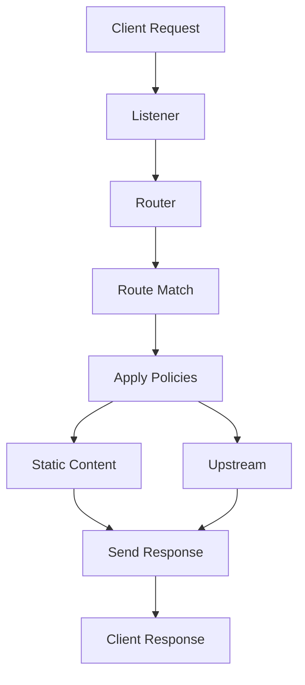

# Ophan System Architecture

## Reverse Proxy

A reverse proxy receives incoming requests and forwards them to internal services or upstream backends.

Examples:

- NGINX
- HAProxy
- Envoy

Typical responsibilities:

- HTTP/HTTPS proxying
- TLS termination
- Header rewriting
- Path rewriting
- Compression
- Caching
- WebSocket support
- HTTP/2 support
- IPv4/IPv6 support
- Unix Domain Socket (UDS) support

---

## Load Balancer

A load balancer distributes traffic across multiple backend instances.

Examples:

- HAProxy
- Envoy
- Traefik

Example:

```txt
client
   ↓
load balancer
   ├── api-1
   ├── api-2
   └── api-3
```

Core features:

- Round-robin balancing
- Least-connections balancing
- Weighted balancing
- Health checks
- Automatic failover
- Sticky sessions

In many modern architectures, the load balancer also acts as a reverse proxy.

---

## API Gateway

An API Gateway is a specialized reverse proxy focused on API traffic management.

It typically provides:

- JWT/OAuth authentication
- Rate limiting
- API key management
- Request validation
- CORS handling
- Observability and metrics
- Request/response transformations
- Advanced routing
- Quotas
- Tenant isolation and policies

Examples:

- Kong
- Apache APISIX
- KrakenD

---

## Rate Limiter

A rate limiter is a dedicated middleware or infrastructure component used to control traffic flow.

Examples:

- 100 requests/minute per IP
- 1000 requests/minute per token
- Burst control
- Sliding-window throttling

It can live:

- Inside the API Gateway
- Inside the reverse proxy
- As an external distributed service (e.g. Redis-based)

---

# Architecture Overview

```txt
Edge Gateway / API Gateway
    ├── Reverse Proxy
    ├── Load Balancer
    ├── Authentication Gateway
    ├── Rate Limiter
    ├── TLS Terminator
    ├── Router
    ├── Rewrite Engine
    └── Service Mesh Edge
```

This is essentially the same architectural model used internally by:

- Cloudflare
- Amazon Web Services (AWS)
- Microsoft
- Google

---

# Design Principles

## 1. Clear Separation of Concerns

The system should treat the following as independent concepts:

- TLS/SSL
- Routing
- Authentication
- Upstreams (backend pools)
- Policies

This separation improves maintainability, extensibility, and scalability.

---

## 2. Reusable Policies

Instead of duplicating configuration everywhere:

```js
cors: { ... }
cors: { ... }
cors: { ... }
```

Use reusable policy definitions:

```js
policies: [cors_default];
```

Benefits:

- Reduced duplication
- Centralized management
- Easier maintenance
- Consistent behavior across services

---

## 3. Dedicated Upstreams (Backend Pools)

Upstreams should be treated as first-class entities.

Why?

Because features such as:

- Load balancing
- Retries
- Circuit breaking
- Health checks
- Connection pooling

are properties of the upstream, not the route itself.

This separation enables cleaner architecture and more flexible traffic management.

---

## 4. Middleware Pipeline Architecture

The gateway should behave as a composable processing pipeline:

```txt
request
  → tls
  → auth
  → rate limit
  → cors
  → rewrite
  → route
  → upstream
  → response rewrite
```

This design provides:

- Predictable request flow
- Extensibility
- Plugin compatibility
- Better observability
- Fine-grained traffic control

---

# Project Vision

The goal is to build a platform inspired by:

```txt
Envoy + Kong + Traefik + NGINX
```

while focusing on:

- Simpler configuration
- Hot reload support
- Dynamic configuration
- Declarative architecture
- Plugin extensibility
- Developer-friendly UX
- High performance
- Cloud-native deployment

---

# Supported Features

## Core Networking

- HTTP/1.1
- HTTP/2
- HTTP/3
- WebSocket
- gRPC
- TCP proxying
- UDP proxying
- IPv4
- IPv6
- Unix Domain Sockets (UDS)

---

## Proxy Features

- Reverse proxying
- Retries
- Request buffering
- Streaming
- Compression
- Caching
- TLS termination
- Mutual TLS (mTLS)

---

## Gateway Features

- JWT authentication
- OAuth2 / OIDC
- API keys
- RBAC
- CORS
- Rate limiting
- Quotas
- Request/response transformations
- Request validation

---

## Load Balancing

- Round robin
- Weighted balancing
- Least connections
- Sticky sessions
- Passive health checks
- Active health checks

---

# High-Level Configuration Structure

```txt
0. tls
1. listeners
2. upstreams
3. routes
4. policies
```

Additional optional sections may include:

```txt
5. plugins
6. middlewares
7. observability
8. service_discovery
9. security
10. runtime
```

---

# Architectural Philosophy

Ophan is designed around a modular edge architecture where networking, security, routing, and traffic policies are composable building blocks rather than tightly coupled features.

The system prioritizes:

- Simplicity over configuration complexity
- Runtime flexibility
- Horizontal scalability
- Extensibility through plugins
- Cloud-native compatibility
- High-performance request processing

The ultimate objective is to provide a unified edge platform capable of functioning as:

- Reverse proxy
- API Gateway
- Load balancer
- Edge router
- Service mesh entry point
- Traffic control layer
- Security enforcement layer

within a single coherent architecture.


